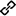
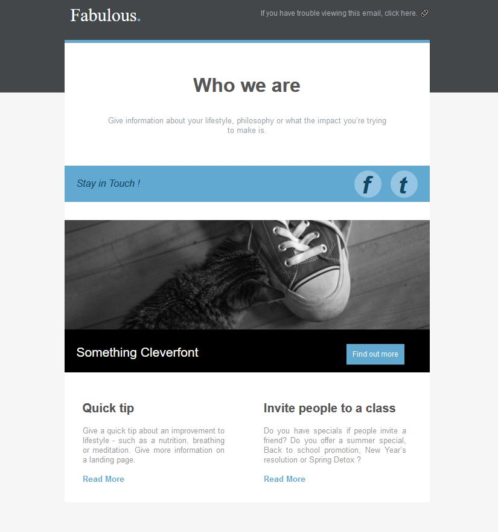
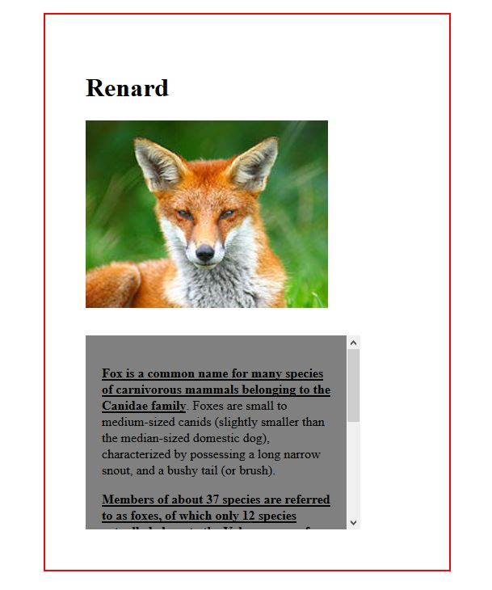
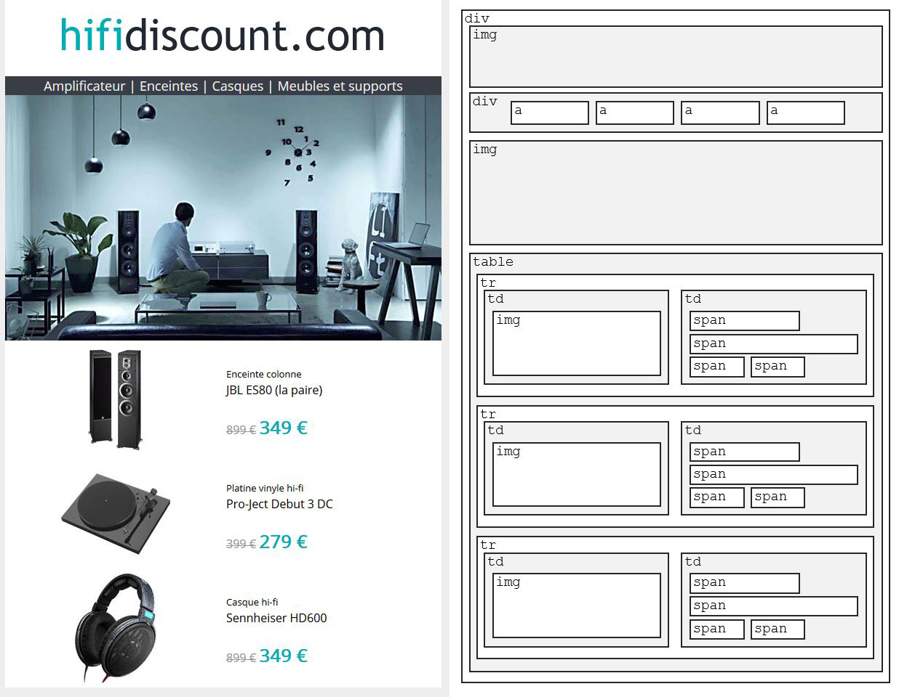

# Sommaire

* <a href="#liens-utiles">Liens utiles</a>
* <a href="#tds">TDs</a>
  * <a href="#td-n5-du-20-octobre-2017">TD n°5 du 20 octobre 2017</a>
  * <a href="#td-n4-du-13-octobre-2017">TD n°4 du 13 octobre 2017</a>
  * <a href="#td-n3-du-6-octobre-2017">TD n°3 du 6 octobre 2017</a>
  * <a href="#td-n2-du-29-septembre-2017">TD n°2 du 29 septembre 2017</a>
  * <a href="#td-n1-du-22-septembre-2017">TD n°1 du 22 septembre 2017</a>
* <a href="#squelette-de-base-dune-page-html">Squelette de base d'une page HTML</a>


# Liens utiles
 [Balises HTML avec leurs caractéristiques](http://htmlreference.io/)

 [Propriétés CSS avec leurs caractéristiques](http://cssreference.io/)

# TDs

## TD n°5 du 20 octobre 2017

 [Présentation](TD5/TD5.pdf)

### Exercice 1

[Sources de l'exercice](https://langages-web.github.io/TD5/TD5-EX1.zip)

[Résultat à obtenir](https://langages-web.github.io/TD5/resultat.jpg)

Couleurs à utiliser :
* #fad000 - Orange
* #d2eae3 - Bleu pale

Nouvelle propriété :
* border-radius : 15px;  _(coins arrondis)_

URLs des images à utiliser :
* https://langages-web.github.io/TD5/slider.jpg
* https://langages-web.github.io/TD5/what1.png
* https://langages-web.github.io/TD5/what2.png
* https://langages-web.github.io/TD5/what3.png
* https://langages-web.github.io/TD5/work1.jpg
* https://langages-web.github.io/TD5/work2.jpg
* https://langages-web.github.io/TD5/work3.jpg
* https://langages-web.github.io/TD5/work4.jpg

## TD n°4 du 13 octobre 2017

 [Présentation](TD4/TD4.pdf)

### Exercice 1

[Fichiers à utiliser](TD4-ex1-fichiers.html)

_Clic droit &gt; afficher l'image_


### Exercice 1 - Correction

[Correction](TD4-ex1-corr.html)

### Exercice 2

[Fichiers à utiliser](TD4-ex2-fichiers.html)

_Résultat attendu_



### Exercice 3

URLs des images à utiliser :
* https://langages-web.github.io/TD4/titre.png
* https://langages-web.github.io/TD4/bandeau.jpg
* https://langages-web.github.io/TD4/p1.jpg
* https://langages-web.github.io/TD4/p2.jpg
* https://langages-web.github.io/TD4/p3.jpg

[Fichiers à utiliser](TD4-ex3-fichiers.html)

_Résultat attendu (Clic droit &gt; afficher l'image)_


#### Correction de l'exercice 3

[Correction](TD4-ex3-corr.html)

## TD n°3 du 6 octobre 2017

 [Présentation](TD3/TD3.pdf)

### Exercice 1

URLs des images à utiliser :
* https://langages-web.github.io/TD2/pizza1.png
* https://langages-web.github.io/TD2/pizza2.png
* https://langages-web.github.io/TD2/pizza3.png

#### Correction (Exercices 1 & 2)

[Correction](TD3-ex1-2-corr.html)

## TD n°2 du 29 septembre 2017

 [Présentation](TD2/TD2.pdf)

### Exercice 1

[Texte de l'exercice](TD2-ex1-txt.html)

URLs à utiliser :
* https://projects.eff.org/~barlow/Declaration-Final.html
* http://editions-hache.com/essais/barlow/barlow2.html
* https://www.eff.org/

#### Correction (Exercices 1 & 2)

[Correction](TD2-ex1-2-corr.html)

### Exercice 3

URL de l'image à utiliser :
* https://langages-web.github.io/TD2/photo.png

### Exercice 4

URL à utiliser :
* https://langages-web.github.io/TD2/photo-grande.png

#### Correction (Exercices 3 & 4)

[Correction](TD2-ex3-4-corr.html)

## TD n°1 du 22 septembre 2017

 [Présentation](TD1/TD1.pdf)

 [Support de cours de Stéphanie Walter](TD1/initiation-HTML-CSS.pdf)

 <a href="TD1/avec-CSS.html" target="_blank">Exemple 1 - Une page avec CSS</a>

 <a href="TD1/sans-CSS.html" target="_blank">Exemple 2 - La même page sans CSS</a>

 <a href="TD1/compare.html" target="_blank">Comparatif avec et sans CSS</a>

 <a href="TD1/t1.html" target="_blank">Ma première page Web publiée</a>

# Squelette de base d'une page HTML

```html
<!DOCTYPE html>
<html>
	<head>
		<meta charset="utf-8" />
		<title>Titre</title>
	</head>
	<body>
	</body>
</html>
```
